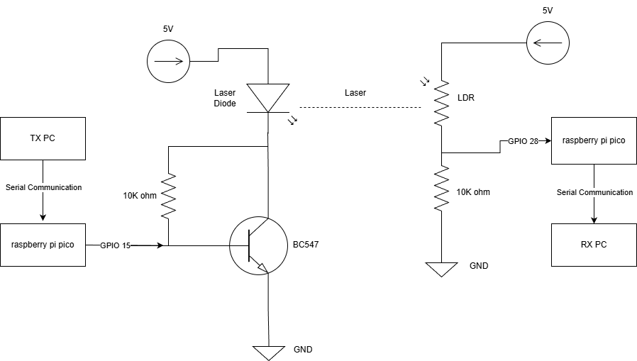
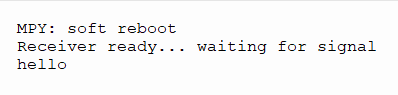
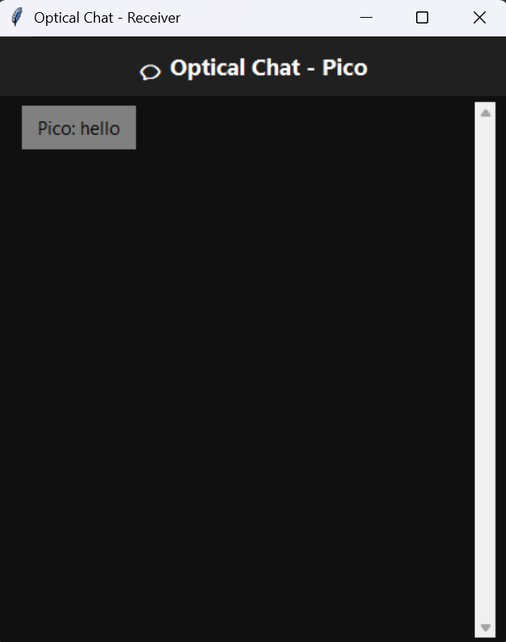
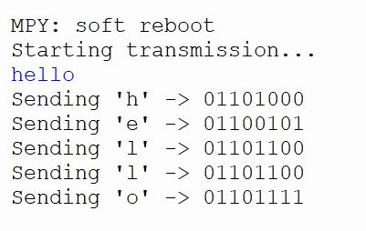

---

# LiFi-Based Data Transfer System

This project demonstrates a simple light-based data communication system using **Raspberry Pi Pico** boards. Data is transmitted through visible light using a **laser diode** as the transmitter and an **LDR sensor** as the receiver. The system supports text message transfer between two computers through a light channel.

---

## Overview

LiFi (Light Fidelity) uses visible light instead of radio waves for wireless communication. This project shows a basic LiFi prototype capable of sending and receiving text messages.
Each character is converted into binary data, transmitted as light pulses, and decoded back into readable text.

---

## System Components

**Hardware**

* Raspberry Pi Pico (2 units)
* Laser Diode or LED (Transmitter)
* LDR (Light Dependent Resistor) for Receiver
* BC547 Transistor for amplification
* Resistors and breadboard
* USB cables for serial communication

**Software**

* MicroPython for Pico firmware
* Python (Tkinter, PySerial) for PC interfaces

---

## Code Files

```
pi_tx.py   – Transmitter Pico code
pi_rx.py   – Receiver Pico code
tx_ui.py   – Sender PC interface
rx_ui.py   – Receiver PC interface
```

---

## Working Principle

1. The transmitter Pico reads a message from the PC.
2. Each character is converted to binary and sent as light pulses (ON/OFF).
3. The receiver Pico reads light intensity values using the LDR.
4. These signals are converted back to binary and decoded to text.
5. The PC displays received messages through a GUI.

---

## Setup Instructions

1. Flash MicroPython on both Raspberry Pi Pico boards.
2. Upload:

   * `pi_tx.py` to the transmitter Pico.
   * `pi_rx.py` to the receiver Pico.
3. Connect:

   * Laser diode/LED to GPIO15 (TX side)
   * LDR to ADC pin 28 (RX side)
4. Edit COM port numbers in `tx_ui.py` and `rx_ui.py`.
5. Run both UI scripts:

   ```bash
   python tx_ui.py
   python rx_ui.py
   ```
6. Type messages in the transmitter window to send data over light.

---

## Images and Outputs

### Block Diagram of LiFi Based Data Transfer System



### Receiver Side Output (In Raspberry Pi Pico)



### Receiver Side UI (In PC)



### Transmitter Side Output (In Raspberry Pi Pico)



### Transmitter Side UI (In PC)


---

## Results

* Range: 1–2 meters
* Speed: ~30 bps
* Accuracy: 95–98% in stable lighting
* Secure short-range data transfer with low power consumption

---

## Future Improvements

* Use photodiodes for faster response
* Add error correction
* Improve data rate with better modulation
* Enable multi-node LiFi networking

---

## Contributors

* Tholkappiyan B – 23BCE20158
* Pranav P S – 23BCE7250
* Muhammad Sajid Y – 23BCE7802
* Ganesh M – 23BCE8887
* V K Rohith – 23BCE8997
* Hari Prasath M – 23BCE8999

---

## References

* [Li-Fi - Wikipedia](https://en.wikipedia.org/wiki/Li-Fi)
* [MicroPython](https://micropython.org/)
* [Raspberry Pi Pico](https://www.raspberrypi.com/products/raspberry-pi-pico/)
* [Python.org](https://www.python.org/)

---
